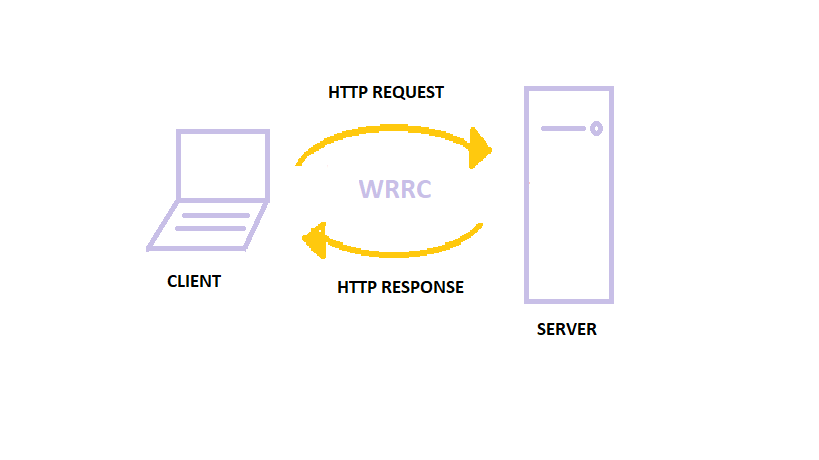

# LAB: Express
we’ll be using a moving away from json-server and creating a “real” API server of our own, using Express. Our express server will be coded for modularity and performance. You will replicate the input/output of json-server but storing data in memory to simulate full CRUD functionality, but without persistence.

### Author: Raghad Al-Quran

### Links and Resources
- [submission PR class-07](https://github.com/401-advanced-javascript-raghad/api-server-new/pull/2)
- [submission PR class-08](https://github.com/401-advanced-javascript-raghad/api-server-new/pull/3)
- [submission PR class-09](https://github.com/401-advanced-javascript-raghad/api-server-new/pull/5)

### Modules
#### `Node.js` , `Postman` , `Swagger` , `HTTPie` , `curl`

### Packages
#### `express` , `jest` , `supertest`

#### How to initialize/run your application
- GET ALL: GET - http://localhost:3000/api/v1/categories
- GET ONE: GET - http://localhost:3000/api/v1/categories/1
- UPDATE ONE: PATCH or PUT - http://localhost:3000/api/v1/categories/1
- DELETE ONE: DELETE - http://localhost:3000/api/v1/categories/1
- GET ALL: GET - http://localhost:3000/api/v1/products
- GET ONE: GET - http://localhost:3000/api/v1/products/1
- UPDATE ONE: PATCH or PUT - http://localhost:3000/api/v1/products/1
- DELETE ONE: DELETE - http://localhost:3000/api/v1/products/1

#### Tests

- Test: `node index.js` or `nodemon`

#### UML

